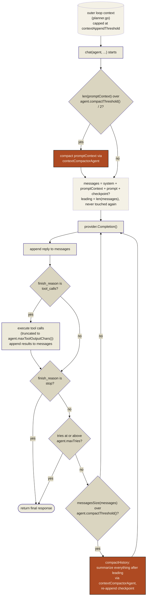

# Context compaction: two layers

A naming note before diving in: "context" means two unrelated things in
this codebase. The plan's accumulated string (`planner.go`'s `context`
parameter, `appendContext`, `promptContext`) is what this whole doc is
about. `chat()` also takes a `ctx context.Context` (Go's stdlib
cancellation type), used only to bound how long a call is allowed to run —
e.g. `e2e_test.go` gives each subtest its own `context.WithTimeout` so a
stalled completion call fails that one subtest instead of hanging the
whole suite. The two never influence each other; `ctx` has nothing to do
with compaction.

Larkspur trims context in two places, and both call the same
`contextCompactorAgent` to do the actual summarizing, which makes them easy to
conflate. This doc separates them.

- The **outer loop** (`planner.go`'s `appendContext`) caps the plain-string
  record of a plan's progress as it's handed from one pipeline stage to the
  next, against a hardcoded ceiling that's the same regardless of which
  agent is involved.
- The **inner loop** (`chat.go`) trims the message list *inside* any single
  `chat()` call, sized off that specific call's own agent — and also
  compacts an oversized incoming context before that call even starts.

The outer loop's ceiling is deliberately coarser than the inner loop's: it
exists only to stop a long-running plan's context from growing so large
that *every* remaining `chat()` call has to immediately compact on entry.
The inner loop's per-agent check is the one that's actually sized to fit a
specific model.

## Why two layers instead of one

An earlier version of this let the outer loop grow completely unbounded,
relying entirely on the inner loop's per-agent check to shrink an oversized
context on the way into `chat()`. That turned every `appendContext` call
into a ticking clock: once the accumulated context passed a given agent's
own threshold, *every single remaining `chat()` call* in the plan would
re-trigger a compaction on entry, burning a summarization call on every
turn instead of only occasionally. A coarse, model-agnostic outer ceiling
avoids that, while still being high enough that it rarely fires for a
plan of ordinary size.

The outer ceiling is intentionally not sized off any particular agent's
`contextTokens` — the outer loop doesn't know in advance which agent will
consume its accumulated context next (the objective agent, then the
verifier, then the summarizer, potentially different models with different
windows). `maxOuterContextTokens` (256,000 tokens) is picked to sit well
under what most current models support, as a safety valve rather than a
target to fill.

## Fig. 1 — Outer loop (`planner.go` · `appendContext`)

```mermaid
%%{init: {"theme": "base", "themeVariables": {"primaryColor":"#edeadb","primaryTextColor":"#1d1b16","primaryBorderColor":"#4b3e93","lineColor":"#1d1b16","secondaryColor":"#dad5c0","tertiaryColor":"#f4f1e6"}}}%%
flowchart LR
    RT["ROUTER<br/>chat • no tools • 1 turn"]:::agent
    CR["CREATOR<br/>chat • builds the plan"]:::agent
    OB["OBJECTIVE AGENT<br/>chat • developer / generalist"]:::agent
    VF["VERIFIER<br/>chat • one checklist item"]:::agent
    SM["SUMMARIZER<br/>chat • closes out the plan"]:::agent
    AC1{{"appendContext"}}:::fn
    AC2{{"appendContext"}}:::fn
    CM1["compact via<br/>contextCompactorAgent"]:::trigger
    CM2["compact via<br/>contextCompactorAgent"]:::trigger
    CTX1[("context")]:::state
    CTX2[("context")]:::state

    RT -- "need_plan" --> CR --> OB
    OB -- "result" --> AC1
    AC1 -- "over contextAppendThreshold" --> CM1 --> CTX1
    AC1 -- "at or under" --> CTX1
    CTX1 --> VF
    VF -- "result" --> AC2
    AC2 -- "over contextAppendThreshold" --> CM2 --> CTX2
    AC2 -- "at or under" --> CTX2
    CTX2 -- "checklist item remains" --> VF
    CTX2 -- "checklist done" --> SM

    classDef agent fill:#edeadb,stroke:#4b3e93,stroke-width:1.5px,color:#1d1b16;
    classDef fn fill:#dad5c0,stroke:#4b3e93,stroke-width:1px,color:#1d1b16;
    classDef trigger fill:#ae4a22,stroke:#1d1b16,stroke-width:1.5px,color:#f4f1e6;
    classDef state fill:#f4f1e6,stroke:#8e82c9,stroke-width:1px,color:#1d1b16,stroke-dasharray: 3 2;
```

`appendContext` concatenates each stage's result onto the running `context`
string. Past `contextAppendThreshold`, it hands the whole thing to the
compactor agent instead of letting it grow further.

## Fig. 2 — Inner loop (`chat.go` · the ReAct loop)

`leading` is fixed at the start of the call (system prompt, promptContext,
prompt, checkpoint) and is never summarized away by `compactHistory` —
only turns added *after* it are collapsed. The upfront `promptContext`
check exists precisely because `leading` is otherwise untouchable: without
it, an oversized incoming context would land there permanently for the
rest of the call.

## Threshold specification

| Name | Value | Meaning |
|---|---:|---|
| `maxOuterContextTokens` | 256,000 (hardcoded, `planner.go`) | Outer-loop ceiling, independent of any agent's `contextTokens`. Sized well under what most current models support — a safety valve, not a target. |
| `contextAppendThreshold()` | `charBudget(maxOuterContextTokens)` | Outer-loop trigger. Checked against the accumulated plan `context` string. |
| `agent.contextTokens` | queried per agent (`agents.go`) | The agent's model's real context length. Chat completions go through the OpenAI-compatible endpoint, which doesn't expose this, so `RefreshAgentContextWindows` queries it separately from ollama's native `/api/show` (`model_info["<arch>.context_length"]`) at startup (`src/provider.go`'s `getProvider`) and overwrites `defaultModelContextTokens` (32,000) for whichever agents it can reach. A model it can't query keeps its previous value rather than blocking startup. |
| `charsPerToken` | 4 | Rough heuristic for English text and code — no tokenizer is available to measure exactly. |
| `charBudget(tokens)` | `tokens × charsPerToken ÷ 2` | Shared conversion from a token budget to a character threshold, used by both layers above. |
| `agent.compactThreshold()` | `charBudget(contextTokens)` | This agent's own inner-loop trigger. Checked against one `chat()` call's message list, and (at half this value) against an incoming `promptContext` before it enters `leading`. |
| `agent.maxToolOutputChars()` | `compactThreshold() ÷ 10` | Caps a single tool result (`tool.go`), so one oversized result can't dominate this agent's share of its own budget. |

Every agent uses the same model today, so in practice they all currently
share one `contextTokens` value — but the inner loop doesn't assume that.
Point one agent at a larger-context model and its own threshold scales
with it, independent of every other agent's window and independent of the
outer loop's fixed ceiling.
